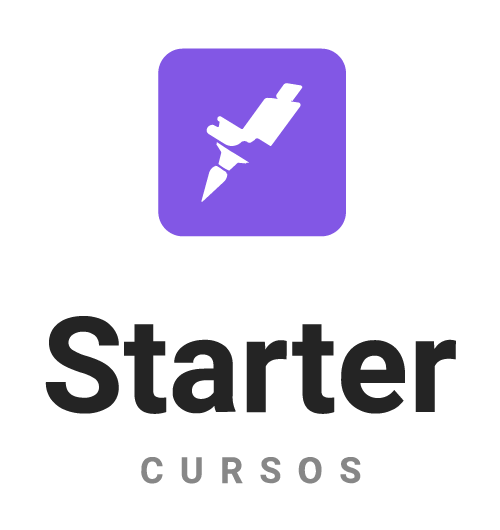

    

# :rocket: Challenges

- [x] Challenge 1.1 - [objects](src/challenge_1-1)
- [x] Challenge 1.2 - [operators](src/challenge_1-2)
- [x] Challenge 1.3 - [boleans](src/challenge_1-3)
- [x] Challenge 1.4 - [conditions](src/challenge_1-4)
- [x] Challenge 1.5 - [array](src/challenge_1-5)
- [x] Challenge 2.1 - [Create Elements](src/challenge_2-1)
- [x] Challenge 2.2 - [AddEventListener](src/challenge_2-2)
- [x] Challenge 2.3 - [Create Elements and use data](src/challenge_2-3)
- [x] Challenge 2.4 - [List, add and remove data](src/challenge_2-4)
- [x] Challenge 3.0 - [To-do List](src/challenge_3-0)
- [x] Challenge 4.1 - [Promisses](src/challenge_4-1)
- [ ] Challenge 4.2 - [JS Async](src/challenge_4-2)
- [ ] Challenge 4.3 - [JS Async](src/challenge_4-3)

# :memo: License

This project is protected by the MIT license. See the file [LICENSE](/LICENSE) for more details.

---

### **Developed by** 
